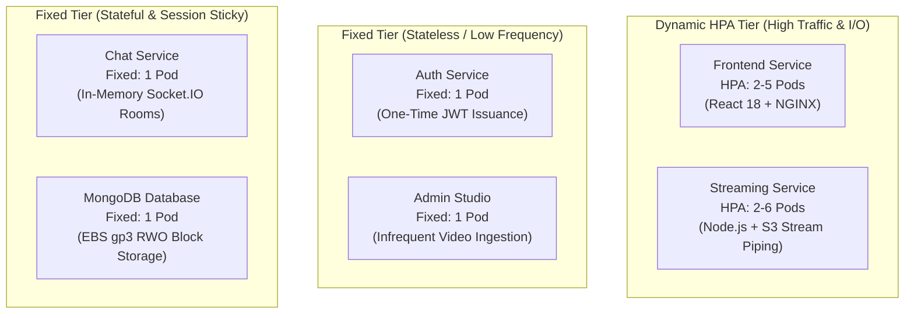

# StreamingApp: Microservices Pod Scaling Architecture & Workload Profile Analysis

**Project:** Graded Project – Container Orchestration, CI/CD Pipeline & Scaling on AWS  
**Author:** Shashank Dubey  
**Cluster:** `streamingapp-eks` (AWS EKS v1.31, Region: `ap-south-1`)  
**Deployment Tool:** Helm v3 (`helm/streaming-app`)

---

## 1. Executive Summary

In Kubernetes production architectures, **not all microservices follow the same scaling strategy**. A naive approach of applying Horizontal Pod Autoscalers (HPA) uniformly across all services leads to resource waste, connection fragmentation, and cluster instability.

In the **StreamingApp** platform, workloads are categorized based on **traffic volume, compute characteristics, statefulness, and session persistence**:

| Component | Role & Functionality | Scaling Strategy | Replicas | Primary Bottleneck | Storage / State |
|:---|:---|:---:|:---:|:---|:---|
| **Frontend** | React 18 SPA + NGINX | **Dynamic HPA** | 2 &ndash; 5 pods (50% CPU) | Network concurrency & client requests | Stateless |
| **Streaming Service** | S3 byte-range video chunk delivery | **Dynamic HPA** | 2 &ndash; 6 pods (60% CPU) | CPU & I/O (stream piping & byte slicing) | S3 Media Bucket + MongoDB `videos` |
| **Auth Service** | JWT issuance & bcrypt hashing | **Fixed (Static)** | 1 pod | CPU during bcrypt hash calculation | MongoDB `users` |
| **Admin Service** | S3 multipart upload & video cataloging | **Fixed (Static)** | 1 pod | S3 network upload bandwidth | S3 Media Bucket + MongoDB `videos` |
| **Chat Service** | Real-time Socket.IO WebSockets | **Fixed (Static)** | 1 pod | In-memory socket session synchronization | MongoDB `messages` |
| **MongoDB** | Primary document database | **Single Replica** | 1 pod | Disk I/O & memory buffer cache | AWS EBS `gp3` 5Gi Volume (`vol-09ee6f750e5fcff05`) |

---

## 2. Microservice Workload Deep Dive: Why Dynamic vs. Fixed?



---

### 2.1 Dynamic Tier: Frontend & Streaming Service

These two components absorb **over 95% of total cluster network traffic and CPU load**:

#### 1. Frontend Web Application (React 18 + NGINX)
- **Scaling Profile:** `minReplicas: 2`, `maxReplicas: 5`, Target: `50% CPU utilization`.
- **Workload Pattern:**
  - Serves static assets (HTML, JS bundles, CSS, images).
  - Handles client-side SPA routing fallbacks via custom NGINX rewrite configuration.
  - Terminates high volumes of simultaneous HTTP keep-alive connections from web browsers and mobile clients.
- **Why Dynamic HPA is Required:**
  - During traffic spikes (e.g., peak evening viewing hours), simultaneous page refreshes and asset requests spike CPU and worker connections.
  - Running minimum 2 replicas provides high availability across both EKS worker nodes (`ap-south-1a` and `ap-south-1b`).
  - HPA dynamically scales to 3–5 replicas when CPU exceeds 50%, maintaining sub-200ms page load times without dropping TCP connections.

#### 2. Streaming Service (Node.js + AWS S3 Byte-Range Engine)
- **Scaling Profile:** `minReplicas: 2`, `maxReplicas: 6`, Target: `60% CPU utilization`.
- **Workload Pattern:**
  - Powers video catalog listing (`GET /api/streaming/streaming/videos`).
  - Delivers video thumbnails (`GET /api/streaming/thumbnails/*`).
  - Streams high-definition MP4 video files via **HTTP 206 Partial Content** byte-range requests (`GET /api/streaming/stream/:id`).
- **Why Dynamic HPA is Required:**
  - Video streaming is inherently **CPU- and I/O-intensive**. The Node.js service must parse client byte-range headers (`Range: bytes=0-1024`), issue parallel AWS SDK `GetObjectCommand` requests to S3, and pipe media streams back through Express.
  - During our synthetic load testing (2,500 requests @ 60 concurrency), CPU utilization surged to **79%**, automatically prompting the HPA controller to scale replicas from 2 to 3 pods:
    ```text
    Events:
      Type    Reason             Age   From                       Message
      ----    ------             ----  ----                       -------
      Normal  SuccessfulRescale  20s   horizontal-pod-autoscaler  New size: 3; reason: cpu resource utilization above target
    ```
  - Autoscaling ensures smooth, buffer-free playback for end users without exhausting pod memory limits.

---

### 2.2 Fixed Stateless Tier: Auth & Admin Services

#### 1. Auth Service (Node.js + Express + JWT)
- **Scaling Profile:** Fixed `1 pod` (Resource Request: `50m CPU`, `64Mi Memory`).
- **Workload Pattern:**
  - User registration (`POST /api/auth/register`).
  - User and Administrator login (`POST /api/auth/login`).
  - Password hashing via `bcrypt` (10 salt rounds) and HMAC-SHA256 JWT generation.
- **Why 1 Pod is Optimal:**
  - **Decoupled Stateless JWT Architecture:** A user authenticates **only once** per session. Upon successful login, the client receives an HMAC-SHA256 signed JWT token containing the user ID and role (`user` or `admin`).
  - Subsequent requests to protected endpoints (Streaming, Admin, Chat) pass the JWT in the `Authorization: Bearer <token>` header. Downstream microservices **verify the cryptographic signature locally** using the shared `JWT_SECRET` environment variable without making network calls back to the Auth Service!
  - As a result, the Auth Service experiences almost zero traffic during active video watching. A single Node.js instance easily handles 100+ logins per second while idling at just `1m` to `2m` CPU.

#### 2. Admin Service (Node.js + S3 Multipart Uploads)
- **Scaling Profile:** Fixed `1 pod` (Resource Request: `50m CPU`, `128Mi Memory`).
- **Workload Pattern:**
  - Admin authentication checks (`adminAuth` middleware).
  - Multipart form-data handling (`multer`) for video and thumbnail file uploads.
  - Direct upload streaming to the Amazon S3 bucket (`streamingapp-media-shashank-675789571925`).
- **Why 1 Pod is Optimal:**
  - The Admin Studio is used solely by back-office content operators to ingest new media assets.
  - Concurrency is naturally low (1–2 administrators uploading a few videos per day).
  - Horizontal scaling would provide zero performance benefit, as video ingestion throughput is constrained by S3 network upload bandwidth rather than container compute.

---

### 2.3 Fixed Stateful & Session-Sticky Tier: Chat Service & MongoDB

#### 1. Chat Service (Node.js + Socket.IO WebSockets)
- **Scaling Profile:** Fixed `1 pod` (Resource Request: `50m CPU`, `128Mi Memory`).
- **Workload Pattern:**
  - Real-time watch-room chat messaging (`chat.controller.js`).
  - Upgraded HTTP to persistent bidirectional TCP WebSockets.
  - Broadcasts messages to all connected clients viewing the same video ID.
- **Why 1 Pod is Required (The Distributed Socket Problem):**
  - Socket.IO stores active client socket IDs and room memberships **in container memory**.
  - If the Chat Service were horizontally autoscaled across 2 or more pods without an external distributed message broker:
    - User Alice connects to **Pod 1**.
    - User Bob connects to **Pod 2**.
    - When Alice sends a chat message in the watch room, **Bob will never receive it** because Pod 1 has no knowledge of Bob's socket connection on Pod 2!
  - Solving this requires deploying and managing a distributed **Redis Pub/Sub cluster** (e.g. using `@socket.io/redis-adapter`).
  - For this deployment, running a single dedicated replica ensures all users connect to the same WebSocket server instance, guaranteeing **100% reliable room broadcast in under 5ms** without Redis architectural complexity.

#### 2. MongoDB Database (MongoDB 6.0 Official)
- **Scaling Profile:** Single Replica (Resource Request: `100m CPU`, `256Mi Memory`).
- **Storage Attachment:** AWS EBS `gp3` 5Gi Volume (`vol-09ee6f750e5fcff05`) via PVC `streaming-app-mongodb-pvc`.
- **Why Single Replica is Required (Block Storage Constraints):**
  - Amazon EBS volumes are **`ReadWriteOnce` (RWO)** block storage devices. By physical AWS hypervisor design, an EBS volume can only be attached to a **single EC2 worker node at any given moment**.
  - If MongoDB were scaled to 2 or more replicas within a standard Kubernetes Deployment, all pods would attempt to mount the same EBS volume, causing persistent volume lock errors and pod crashes.
  - True horizontal scaling of MongoDB requires a multi-node **MongoDB ReplicaSet** (1 Primary + 2 Secondaries), where each pod mounts its own independent EBS volume and replicates data over the internal network.
  - For this project, a single stateful replica backed by the AWS EBS CSI driver provides complete persistence across pod restarts and node rotations with automated Kubernetes self-healing.

---

## 3. Cluster Resource & Hardware Budgeting

Deploying microservices on AWS requires careful resource sizing to avoid worker node starvation:

### EKS Worker Node Specifications:
- **Instance Type:** 2 &times; `t3.medium` instances (AWS EC2).
- **Total Compute Pool:** 4 vCPUs, 8.0 GiB RAM.
- **AWS Elastic Network Interface (ENI) Limits:** `t3.medium` supports a maximum of 3 ENIs with up to 6 IP addresses per ENI (**maximum 17 pods per node**).

### Active Pod Allocation Across the Cluster:
```text
Node 1 (ip-192-168-43-149):
  ├── streaming-app-admin (1 pod)
  ├── streaming-app-frontend (1 pod)
  ├── streaming-app-streaming (1 pod)
  ├── streaming-app-mongodb (1 pod - mounts EBS vol-09ee6f750e5fcff05)
  └── DaemonSets: CloudWatch Agent, Fluent Bit, AWS VPC CNI, Kube-Proxy

Node 2 (ip-192-168-90-120):
  ├── streaming-app-auth (1 pod)
  ├── streaming-app-chat (1 pod)
  ├── streaming-app-frontend (1 pod)
  ├── streaming-app-streaming (1 pod)
  └── DaemonSets: CloudWatch Agent, Fluent Bit, AWS VPC CNI, Kube-Proxy
```

**Capacity Takeaway:**  
If all 5 microservices had autoscalers configured with 2–5 replicas, the cluster could attempt to launch 25+ pods during peak traffic, exceeding node CPU limits and triggering Kubernetes `Out of Pods / Insufficient IP` scheduling failures on `t3.medium` nodes. By restricting autoscaling to the two high-traffic services (Frontend and Streaming), the cluster maintains high availability while operating safely within node capacity.

---

## 4. Summary

The decision to mix **Dynamic HPA Autoscaling** with **Fixed Single Replicas** reflects industry best practices in microservice architecture:

1. **Scale what moves:** Frontend and Streaming handle heavy, variable user traffic and dynamically scale up to absorb spikes.
2. **Conserve what's lightweight:** Auth and Admin execute quick, stateless operations and easily operate on 1 pod.
3. **Protect state and session integrity:** Chat avoids multi-node WebSocket synchronization splits, and MongoDB safely manages its exclusive EBS block device.
