# Graded Project: Container Orchestration, CI/CD Pipeline & Scaling on AWS
**Student Name:** Shashank Dubey
**Course / Module:** Container Orchestration and Scaling  
**Project Repository:** [github.com/Shashankd48/StreamingApp](https://github.com/Shashankd48/StreamingApp)  
**Upstream Repository:** [github.com/UnpredictablePrashant/StreamingApp](https://github.com/UnpredictablePrashant/StreamingApp)  

---

## Project Overview

In this project, I am containerizing and deploying a real-world multi-service MERN video streaming application (**StreamingApp**). The architecture consists of a React frontend, four Node.js/Express backend microservices (`authService`, `streamingService`, `adminService`, and `chatService` with Socket.IO WebSockets), a MongoDB database, and AWS S3 for media storage.

The deployment lifecycle covers:
1. Version control with Git (forking, remote upstream tracking, branch strategy).
2. Multi-service containerization (Docker, Nginx SPA routing, microservice context standardization).
3. Automated CI pipeline on Jenkins (pushing versioned images to Amazon ECR).
4. Kubernetes cluster deployment on AWS EKS with Helm 3 (deployments, services, ingress routing, stateful persistence, and HPA autoscaling).
5. Observability and monitoring using Amazon CloudWatch (Container Insights, Fluent Bit centralized logging, metric alarms).
6. ChatOps integration for real-time deployment alerts.

---

## Step 1: Version Control Setup with Git

### 1.1 Objective & Approach
Before starting any containerization or infrastructure provisioning, I needed an isolated development environment where I could make modifications, write Dockerfiles, configure Helm charts, and maintain upstream synchronization.

### 1.2 Actions Taken
1. **Forked the Upstream Repository:**  
   I navigated to `github.com/UnpredictablePrashant/StreamingApp` and created a personal fork under my account: `github.com/Shashankd48/StreamingApp`.
   
2. **Configured Local Workspace:**  
   In my local project directory (`d:\Study\HeroVired\assignments\Orchestration and Scaling`), I initialized Git, linked it to my remote fork on GitHub, and pulled down the `main` branch.

3. **Configured Upstream Remote Tracking:**  
   To ensure my fork can always be synced with future bug fixes or updates from the main course repository, I added the upstream remote:

```bash
git remote add origin https://github.com/Shashankd48/StreamingApp.git
git remote add upstream https://github.com/UnpredictablePrashant/StreamingApp.git
```

4. **Verified Remote Configuration:**
```bash
git remote -v
```

*Output:*
```text
origin    https://github.com/Shashankd48/StreamingApp.git (fetch)
origin    https://github.com/Shashankd48/StreamingApp.git (push)
upstream  https://github.com/UnpredictablePrashant/StreamingApp.git (fetch)
upstream  https://github.com/UnpredictablePrashant/StreamingApp.git (push)
```

### 1.3 Why This Was Necessary & What Problem It Solved
- **Isolation:** Forking protects the main course repository from direct commits and allows me to set up personal CI/CD webhooks, ECR registries, and deployment configurations without collisions.
- **Upstream Sync:** Adding `upstream` ensures that whenever the base application receives updates, I can run `git fetch upstream && git merge upstream/main` without breaking my custom DevOps configurations.

---

## Step 2: Prepare the Application (Containerization & Local Validation)

When inspecting the base repository code, I identified several architectural and containerization issues that would have caused silent failures in production, broken CI/CD pipelines in Jenkins, and caused 404 errors in the web browser. 

I resolved these issues systematically before moving to AWS.

---

### 2.1 Problem 1: React SPA Client-Side Routing & 404 Refresh Error

#### The Problem
The frontend is a React Single Page Application (SPA) using React Router for client-side navigation (`/browse`, `/streaming`, `/login`, etc.). 

In the original `frontend/Dockerfile`, the build was copied directly to a default Nginx container image:
```dockerfile
FROM nginx:1.27-alpine AS production
COPY --from=build /app/build /usr/share/nginx/html
```

With default Nginx configuration:
- Visiting the root URL (`/`) works because Nginx finds `index.html`.
- However, if a user clicks on `/browse` and then **refreshes the page**, Nginx searches for a physical directory named `/usr/share/nginx/html/browse/index.html`.
- Because that file does not exist on disk (React handles routing dynamically in the browser), Nginx returns an **HTTP 404 Not Found** error.

#### The Solution
I made two crucial improvements to the frontend container:

1. **Custom Nginx SPA Routing (`frontend/nginx.conf`):**
   I created a custom Nginx configuration file with the `try_files $uri $uri/ /index.html;` directive. This tells Nginx:
   - Check if the exact requested file exists (`$uri`).
   - If not, check if a directory exists (`$uri/`).
   - If neither exists, seamlessly fallback to `/index.html` so React Router can handle navigation dynamically in the browser.
   - I also configured static asset caching (`.js`, `.css`, images) with a 30-day `Cache-Control` header to optimize delivery performance.

2. **Upgraded to `nginx:stable-alpine` (Production Stability & Security):**
   The upstream Dockerfile used `nginx:1.27-alpine`. In NGINX release architecture, odd-numbered minor versions (1.27) belong to the *Mainline* branch (frequent feature additions / development), whereas even-numbered versions belong to the *Stable* branch (critical bug fixes and security backports only). Pinning to `1.27-alpine` left the container vulnerable to unpatched CVEs. I updated the base image to `nginx:stable-alpine`, ensuring we run the latest verified, production-stable NGINX on a hardened, ultra-lightweight Alpine footprint (~23 MB).

#### File Created: `frontend/nginx.conf`
```nginx
server {
    listen 80;
    server_name localhost;

    location / {
        root /usr/share/nginx/html;
        index index.html index.htm;
        try_files $uri $uri/ /index.html;
    }

    # Cache static assets
    location ~* \.(js|css|png|jpg|jpeg|gif|ico|svg)$ {
        root /usr/share/nginx/html;
        expires 30d;
        add_header Cache-Control "public, no-transform";
    }

    error_page 500 502 503 504 /50x.html;
    location = /50x.html {
        root /usr/share/nginx/html;
    }
}
```

#### Updated: `frontend/Dockerfile`
I updated the production stage of `frontend/Dockerfile` to use `nginx:stable-alpine`, copy our custom `nginx.conf` into `/etc/nginx/conf.d/default.conf`, and added an automated container `HEALTHCHECK`:

```dockerfile
FROM node:18-alpine AS build

WORKDIR /app

COPY package*.json ./
RUN npm install

COPY . .

ARG REACT_APP_AUTH_API_URL
ARG REACT_APP_STREAMING_API_URL
ARG REACT_APP_STREAMING_PUBLIC_URL
ARG REACT_APP_ADMIN_API_URL
ARG REACT_APP_CHAT_API_URL
ARG REACT_APP_CHAT_SOCKET_URL

ENV REACT_APP_AUTH_API_URL=${REACT_APP_AUTH_API_URL}
ENV REACT_APP_STREAMING_API_URL=${REACT_APP_STREAMING_API_URL}
ENV REACT_APP_STREAMING_PUBLIC_URL=${REACT_APP_STREAMING_PUBLIC_URL}
ENV REACT_APP_ADMIN_API_URL=${REACT_APP_ADMIN_API_URL}
ENV REACT_APP_CHAT_API_URL=${REACT_APP_CHAT_API_URL}
ENV REACT_APP_CHAT_SOCKET_URL=${REACT_APP_CHAT_SOCKET_URL}

RUN npm run build

FROM nginx:stable-alpine AS production
COPY --from=build /app/build /usr/share/nginx/html
COPY nginx.conf /etc/nginx/conf.d/default.conf

EXPOSE 80

HEALTHCHECK --interval=30s --timeout=3s --retries=3 \
  CMD wget --quiet --tries=1 --spider http://localhost:80/ || exit 1

CMD ["nginx", "-g", "daemon off;"]
```

---

### 2.2 Problem 2: Inconsistent Backend Build Contexts Across Services

#### The Problem
When reviewing the backend services, I noticed an inconsistency in how the Dockerfiles were written:
- `authService/Dockerfile` assumed its build context was `./backend/authService`:
  ```dockerfile
  WORKDIR /app
  COPY package*.json ./
  COPY . .
  ```
- However, `streamingService`, `adminService`, and `chatService` had hardcoded subfolder paths:
  ```dockerfile
  WORKDIR /app/streamingService
  COPY streamingService/package*.json ./
  COPY streamingService/. ./
  ```
  They assumed the Docker build context was the parent `./backend` directory.

**Why this is problematic:**
1. **Breaks CI/CD in Jenkins:** In a clean microservices pipeline, each service should be built independently from its own directory (e.g., `docker build ./backend/streamingService`). Running that command with the old Dockerfile failed with:  
   `COPY failed: file not found: streamingService/package*.json`.
2. **Transfers Unnecessary Files (Slow Builds):** Building with context `./backend` forced Docker to upload the entire backend directory (including a large sample video file `theNights.mp4` in `streamingService/controllers/`) across the Docker daemon for *every single service*.
3. **Inconsistent Container Paths:** One container stored code at `/app`, while the others stored code at `/app/streamingService` or `/app/chatService`.

#### The Solution
I standardized all 4 backend Dockerfiles so each microservice builds cleanly and independently from its own root folder:

```dockerfile
FROM node:18-alpine AS base

WORKDIR /app

COPY package*.json ./
RUN npm install --production

COPY . .
ENV NODE_ENV=production
EXPOSE <SERVICE_PORT>

CMD ["npm", "run", "start"]
```

- **`backend/authService/Dockerfile`**: Exposed Port `3001`
- **`backend/streamingService/Dockerfile`**: Exposed Port `3002`
- **`backend/adminService/Dockerfile`**: Exposed Port `3003`
- **`backend/chatService/Dockerfile`**: Exposed Port `3004`

#### Updated: `docker-compose.yml`
I updated `docker-compose.yml` so that each service explicitly uses its own directory as its build context:

```yaml
  auth:
    build:
      context: ./backend/authService
    ...

  streaming:
    build:
      context: ./backend/streamingService
    ...

  admin:
    build:
      context: ./backend/adminService
    ...

  chat:
    build:
      context: ./backend/chatService
    ...
```

---

### 2.3 Problem 3: Missing `.dockerignore` Files

#### The Problem
`adminService` and `chatService` had no `.dockerignore` files. When running `docker build`, Docker would copy local `node_modules/`, `.git/`, and any local `.env` files into the image. This bloats image size, increases build time, and creates a severe security risk by baking local secret keys into images.

#### The Solution
I created `.dockerignore` files for both `backend/adminService/` and `backend/chatService/`:

```text
node_modules
npm-debug.log
.git
.env
```

---

### 2.4 Local Stack Verification & Health Testing

To verify that all Dockerfiles, configurations, and network dependencies work together properly, I ran:

```bash
docker compose up -d --build
```

#### Verification 1: Inspect Container Status (`docker compose ps`)
All 6 containers started up successfully:
- `orchestrationandscaling-mongo-1`: Port `27017` (MongoDB 6)
- `orchestrationandscaling-auth-1`: Port `3001` (Auth Service)
- `orchestrationandscaling-streaming-1`: Port `3002` (Streaming Service)
- `orchestrationandscaling-admin-1`: Port `3003` (Admin Service)
- `orchestrationandscaling-chat-1`: Port `3004` (Chat Service)
- `orchestrationandscaling-frontend-1`: Port `3000` mapped to container port `80` (React + Nginx)

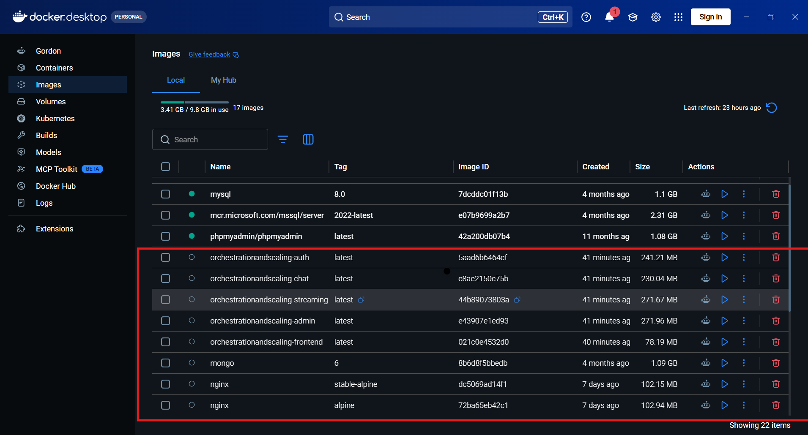
*Figure 2.1: Local Docker images built and tagged for the microservices stack in Docker Desktop.*

#### Verification 2: Endpoint Health Checks
I verified the HTTP responses of each service:
- `curl -I http://localhost:3000` $\rightarrow$ **`HTTP/1.1 200 OK`** (Frontend UI)
- `curl http://localhost:3001/health` $\rightarrow$ **`{"status":"OK"}`** (Auth Service)
- `curl http://localhost:3002/api/health` $\rightarrow$ **`{"status":"ok"}`** (Streaming Service)
- `curl http://localhost:3003/api/health` $\rightarrow$ **`{"status":"ok"}`** (Admin Service)
- `curl http://localhost:3004/api/health` $\rightarrow$ **`{"status":"ok"}`** (Chat Service)

#### Clean Tear Down:
```bash
docker compose down
```

---

## Step 3: AWS Environment Setup, Amazon S3 & Amazon ECR Provisioning

### 3.1 Objective & Approach
With local Docker containerization verified, the next phase was preparing our cloud infrastructure on AWS:
1. Authenticate and configure the AWS CLI with temporary session credentials from the Hero Vired AWS Access Portal.
2. Provision an Amazon S3 bucket with CORS configuration to store video and thumbnail assets for `streamingService` and `adminService`.
3. Create 5 private Amazon Elastic Container Registry (ECR) repositories with image vulnerability scanning on push enabled.
4. Authenticate the local Docker client to Amazon ECR, then build, tag, and push versioned (`v1.0.0`) and `latest` images for all 5 microservices.

---

### 3.2 AWS CLI Authentication & Identity Verification

I configured the AWS CLI on my workstation and verified my active session credentials:

```bash
aws sts get-caller-identity
```

**Output:**
```json
{
    "UserId": "AROAZ2WBSQ5K7GWNUUVM7:shashankd48+HV17@gmail.com",
    "Account": "675789571925",
    "Arn": "arn:aws:sts::675789571925:assumed-role/AWSReservedSSO_AWSAdministratorAccess_746daa54115cde7e/shashankd48+HV17@gmail.com"
}
```

- **AWS Account ID:** `675789571925`
- **Assigned Region:** `ap-south-1` (Asia Pacific - Mumbai)
- **IAM Role:** `AdministratorAccess` via AWS IAM Identity Center (SSO)

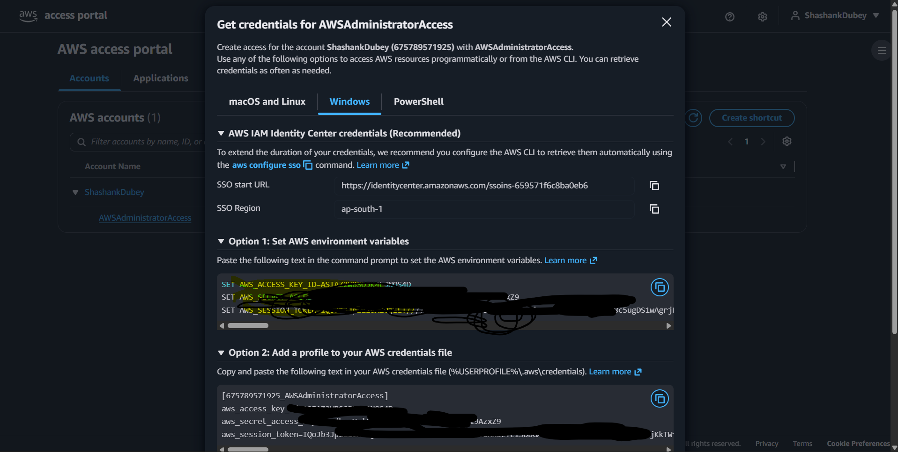
*Figure 3.1: Obtaining programmatic access session credentials from the Hero Vired AWS IAM Identity Center Access Portal.*

---

### 3.3 Amazon S3 Media Storage Bucket & CORS Configuration

The StreamingApp architecture relies on S3 for persistent object storage:
- The **Admin Service** (`backend/adminService/util/s3.js`) handles video uploads (`multipart/form-data`) and writes video files and thumbnails to S3 using `@aws-sdk/client-s3`.
- The **Streaming Service** (`backend/streamingService/controllers/streaming.controller.js`) fetches byte ranges from S3 to stream video smoothly to React clients.

#### 1. Created S3 Bucket:
```bash
aws s3api create-bucket \
  --bucket streamingapp-media-675789571925-ap-south-1 \
  --region ap-south-1 \
  --create-bucket-configuration LocationConstraint=ap-south-1
```

**Output:**
```json
{
    "Location": "http://streamingapp-media-675789571925-ap-south-1.s3.amazonaws.com/",
    "BucketArn": "arn:aws:s3:::streamingapp-media-675789571925-ap-south-1"
}
```

#### 2. Configured CORS (Cross-Origin Resource Sharing):
Because the React frontend runs in browser clients on port 80 / Ingress and makes direct requests to stream media, Cross-Origin Resource Sharing (CORS) is mandatory. Without CORS, the browser blocks video playback due to same-origin policy restrictions.

I applied the following CORS policy:
```json
{
  "CORSRules": [
    {
      "AllowedHeaders": ["*"],
      "AllowedMethods": ["GET", "PUT", "POST", "HEAD"],
      "AllowedOrigins": ["*"],
      "ExposeHeaders": ["ETag"]
    }
  ]
}
```

Applied via AWS CLI (using the policy file stored in `infra/s3-cors.json`):
```bash
aws s3api put-bucket-cors \
  --bucket streamingapp-media-675789571925-ap-south-1 \
  --cors-configuration file://infra/s3-cors.json
```

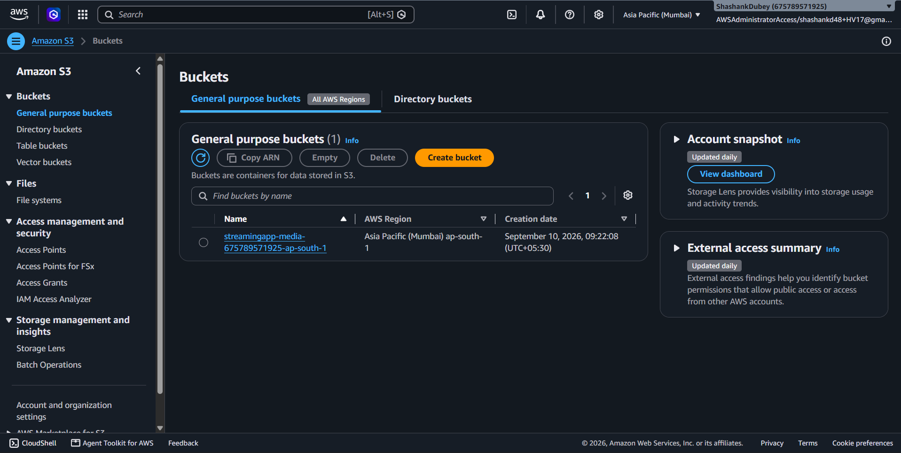
*Figure 3.2: Verification of the created S3 general-purpose bucket `streamingapp-media-675789571925-ap-south-1` in the AWS Management Console.*

> **DevOps Artifacts in `infra/`:**  
> All configuration files and provisioning scripts are permanently version-controlled in the [infra/](file:///d:/Study/HeroVired/assignments/Orchestration%20and%20Scaling/infra) directory:
> - `infra/s3-cors.json`: Declarative CORS specification applied to the S3 bucket.
> - `infra/setup-s3-bucket.ps1` / `.sh`: Repeatable automation script to create the S3 bucket and apply CORS.
> - `infra/setup-ecr-repositories.ps1` / `.sh`: Repeatable automation script to provision all 5 private ECR repositories.
> - `infra/build-and-push-ecr.ps1` / `.sh`: Repeatable automation script to authenticate Docker, tag, and push all microservice images.

---

### 3.4 Amazon ECR Repository Creation

I created 5 dedicated private container repositories in Amazon ECR for the microservices. I explicitly enabled **Image Vulnerability Scanning on Push** (`scanOnPush=true`) to detect CVEs automatically whenever an image is uploaded:

```bash
$repos = @(
  "streamingapp-frontend",
  "streamingapp-auth",
  "streamingapp-streaming",
  "streamingapp-admin",
  "streamingapp-chat"
)

foreach ($repo in $repos) {
    aws ecr create-repository \
      --repository-name $repo \
      --image-scanning-configuration scanOnPush=true \
      --region ap-south-1
}
```

#### Verification: Repository URIs
```bash
aws ecr describe-repositories --region ap-south-1 --query "repositories[].{Name:repositoryName,URI:repositoryUri}" --output table
```

**Output:**
```text
----------------------------------------------------------------------------------------------------
|                                       DescribeRepositories                                       |
+-------------------------+------------------------------------------------------------------------+
|          Name           |                                  URI                                   |
+-------------------------+------------------------------------------------------------------------+
|  streamingapp-frontend  |  675789571925.dkr.ecr.ap-south-1.amazonaws.com/streamingapp-frontend   |
|  streamingapp-auth      |  675789571925.dkr.ecr.ap-south-1.amazonaws.com/streamingapp-auth       |
|  streamingapp-streaming |  675789571925.dkr.ecr.ap-south-1.amazonaws.com/streamingapp-streaming  |
|  streamingapp-admin     |  675789571925.dkr.ecr.ap-south-1.amazonaws.com/streamingapp-admin      |
|  streamingapp-chat      |  675789571925.dkr.ecr.ap-south-1.amazonaws.com/streamingapp-chat       |
+-------------------------+------------------------------------------------------------------------+
```

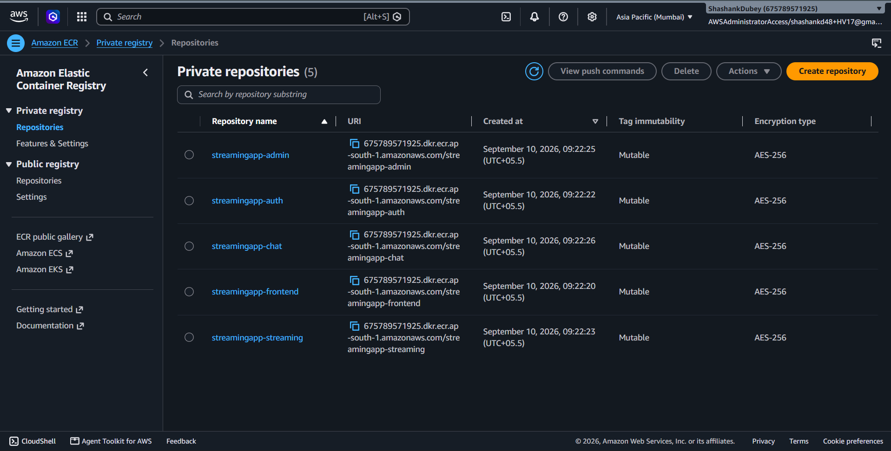
*Figure 3.3: The five dedicated private Amazon ECR repositories provisioned in region `ap-south-1` with vulnerability scanning enabled.*

---

### 3.5 Docker Authentication & Image Push to Amazon ECR

#### 1. Authenticated Docker to ECR Registry:
```bash
aws ecr get-login-password --region ap-south-1 | docker login --username AWS --password-stdin 675789571925.dkr.ecr.ap-south-1.amazonaws.com
```
*Output:* `Login Succeeded`

#### 2. Built, Tagged and Pushed All 5 Microservices:
To follow production release best practices, I pushed both an immutable semantic version tag (`v1.0.0`) and the rolling `latest` tag for each service:

```bash
# 1. Frontend (React 18 + Nginx Stable Alpine)
docker build -t 675789571925.dkr.ecr.ap-south-1.amazonaws.com/streamingapp-frontend:v1.0.0 \
             -t 675789571925.dkr.ecr.ap-south-1.amazonaws.com/streamingapp-frontend:latest ./frontend
docker push 675789571925.dkr.ecr.ap-south-1.amazonaws.com/streamingapp-frontend:v1.0.0
docker push 675789571925.dkr.ecr.ap-south-1.amazonaws.com/streamingapp-frontend:latest

# 2. Auth Service (Node.js / Express / JWT)
docker build -t 675789571925.dkr.ecr.ap-south-1.amazonaws.com/streamingapp-auth:v1.0.0 \
             -t 675789571925.dkr.ecr.ap-south-1.amazonaws.com/streamingapp-auth:latest ./backend/authService
docker push 675789571925.dkr.ecr.ap-south-1.amazonaws.com/streamingapp-auth:v1.0.0
docker push 675789571925.dkr.ecr.ap-south-1.amazonaws.com/streamingapp-auth:latest

# 3. Streaming Service (Node.js / HLS / S3)
docker build -t 675789571925.dkr.ecr.ap-south-1.amazonaws.com/streamingapp-streaming:v1.0.0 \
             -t 675789571925.dkr.ecr.ap-south-1.amazonaws.com/streamingapp-streaming:latest ./backend/streamingService
docker push 675789571925.dkr.ecr.ap-south-1.amazonaws.com/streamingapp-streaming:v1.0.0
docker push 675789571925.dkr.ecr.ap-south-1.amazonaws.com/streamingapp-streaming:latest

# 4. Admin Service (Node.js / S3 Video Uploads)
docker build -t 675789571925.dkr.ecr.ap-south-1.amazonaws.com/streamingapp-admin:v1.0.0 \
             -t 675789571925.dkr.ecr.ap-south-1.amazonaws.com/streamingapp-admin:latest ./backend/adminService
docker push 675789571925.dkr.ecr.ap-south-1.amazonaws.com/streamingapp-admin:v1.0.0
docker push 675789571925.dkr.ecr.ap-south-1.amazonaws.com/streamingapp-admin:latest

# 5. Chat Service (Node.js / Socket.IO)
docker build -t 675789571925.dkr.ecr.ap-south-1.amazonaws.com/streamingapp-chat:v1.0.0 \
             -t 675789571925.dkr.ecr.ap-south-1.amazonaws.com/streamingapp-chat:latest ./backend/chatService
docker push 675789571925.dkr.ecr.ap-south-1.amazonaws.com/streamingapp-chat:v1.0.0
docker push 675789571925.dkr.ecr.ap-south-1.amazonaws.com/streamingapp-chat:latest
```

#### 3. Verification of Images in ECR:
I queried the ECR repository image details across all 5 services:

```bash
$repos = @("streamingapp-frontend", "streamingapp-auth", "streamingapp-streaming", "streamingapp-admin", "streamingapp-chat")
foreach ($repo in $repos) {
    Write-Host "=== $repo ==="
    aws ecr describe-images --repository-name $repo --region ap-south-1 --query "imageDetails[].{Tags:imageTags,Size:imageSizeInBytes}" --output table
}
```

**Results:**
- **`streamingapp-frontend`**: Size ~29.5 MB | Tags: `['v1.0.0', 'latest']`
- **`streamingapp-auth`**: Size ~56.4 MB | Tags: `['v1.0.0', 'latest']`
- **`streamingapp-streaming`**: Size ~59.3 MB | Tags: `['v1.0.0', 'latest']`
- **`streamingapp-admin`**: Size ~59.6 MB | Tags: `['v1.0.0', 'latest']`
- **`streamingapp-chat`**: Size ~54.8 MB | Tags: `['v1.0.0', 'latest']`

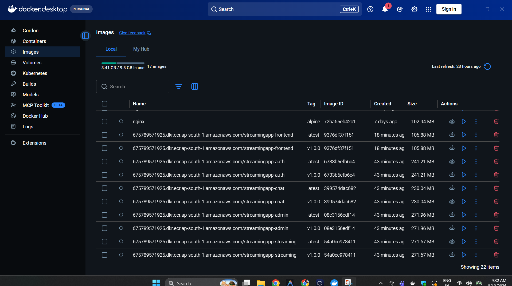
*Figure 3.4: Docker Desktop displaying local images tagged with full Amazon ECR registry URIs (`v1.0.0` and `latest`) ready for deployment.*

---

## Step 4: Continuous Integration (CI) with Jenkins

### 4.1 Objective & Architecture
To automate the build, testing, and deployment lifecycle of our microservices, I configured an automated Continuous Integration (CI) pipeline using the **Shared Academic Jenkins Master** (`https://jenkinsacademics.herovired.com/`).

Because this Jenkins environment is shared across multiple students:
1. **Isolated Naming Convention:** All credentials and pipeline jobs are explicitly prefixed with my name (`Shashank-StreamingApp-CI`, `Shashank-aws-ecr-credentials`, `Shashank-github-token`) to prevent naming collisions.
2. **Dedicated ECR Push Destination:** Built images are pushed exclusively to my personal AWS account ECR registry (`675789571925.dkr.ecr.ap-south-1.amazonaws.com`).
3. **Automated Workspace & Disk Cleanup:** The pipeline executes post-build cleanup (`docker rmi -f`) to prevent filling up the shared Jenkins agent disk.

---

### 4.2 Jenkins Global Credentials Configuration

I registered two dedicated sets of credentials in Jenkins (**Manage Jenkins** $\rightarrow$ **Credentials** $\rightarrow$ **System** $\rightarrow$ **Global credentials**):

1. **AWS ECR Credentials (`Shashank-aws-ecr-credentials`):**
   - **Kind:** `Username with password`
   - **Username:** `AKIAZ2WBSQ5K...` (Access Key ID of `jenkins-ecr-user`)
   - **Password:** `<AWS_SECRET_ACCESS_KEY>` (Secret Access Key securely masked)
   - **Architecture Decision:** Rather than relying on short-lived AWS IAM Identity Center (SSO) session tokens that expire every few hours, I provisioned access keys for a dedicated IAM service user (`jenkins-ecr-user`) attached to the `Jenkins-ECR-PowerUser-Policy`. This guarantees the CI pipeline never fails due to expired session tokens.

2. **GitHub Access Token (`Shashank-github-token`):**
   - **Kind:** `Username with password`
   - **Username:** `Shashankd48` (GitHub Username)
   - **Password:** `<GITHUB_PAT>` (Personal Access Token securely masked)
   - **Technical Troubleshooting:** When initially configured as `Secret text`, the Jenkins Git SCM plugin (`hudson.plugins.git.UserRemoteConfig`) filtered the credential out of the repository dropdown. Re-creating it as `Username with password` resolved the compatibility issue with the Git plugin.

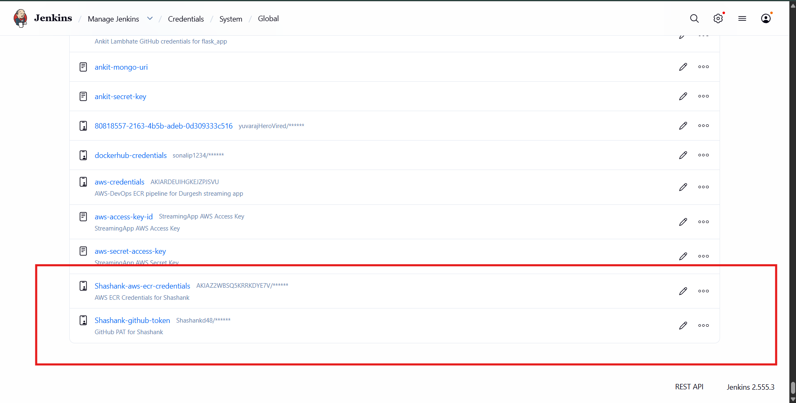
*Figure 4.1: Dedicated AWS ECR credentials and GitHub access token stored in the Jenkins Global Credentials store.*

---

### 4.3 Declarative Jenkins Pipeline (`Jenkinsfile`)

I authored a production declarative `Jenkinsfile` in the root of the repository:

```groovy
pipeline {
    agent any

    environment {
        AWS_ACCOUNT_ID = '675789571925'
        AWS_REGION     = 'ap-south-1'
        AWS_CRED_ID    = 'Shashank-aws-ecr-credentials'
        ECR_REGISTRY   = "${AWS_ACCOUNT_ID}.dkr.ecr.${AWS_REGION}.amazonaws.com"
        IMAGE_TAG      = "${BUILD_NUMBER}-${GIT_COMMIT.take(7)}"
    }

    options {
        disableConcurrentBuilds()
        timeout(time: 25, unit: 'MINUTES')
    }

    stages {
        stage('Checkout SCM') {
            steps {
                echo "==> [1/5] Checking out source repository from GitHub"
                checkout scm
            }
        }

        stage('Authenticate with Amazon ECR') {
            steps {
                echo "==> [2/5] Logging into Amazon ECR Registry: ${ECR_REGISTRY}"
                withCredentials([usernamePassword(credentialsId: env.AWS_CRED_ID, usernameVariable: 'AWS_ACCESS_KEY_ID', passwordVariable: 'AWS_SECRET_ACCESS_KEY')]) {
                    sh """
                        aws ecr get-login-password --region ${AWS_REGION} | \
                        docker login --username AWS --password-stdin ${ECR_REGISTRY}
                    """
                }
            }
        }

        stage('Parallel Docker Build') {
            parallel {
                stage('Build Frontend') {
                    steps {
                        echo "==> [3a/5] Building Frontend React + NGINX Image"
                        sh """
                            docker build \
                              --build-arg REACT_APP_AUTH_API_URL=/api/auth \
                              --build-arg REACT_APP_STREAMING_API_URL=/api/streaming \
                              --build-arg REACT_APP_STREAMING_PUBLIC_URL=/api/streaming \
                              --build-arg REACT_APP_ADMIN_API_URL=/api/admin \
                              --build-arg REACT_APP_CHAT_API_URL=/api/chat \
                              --build-arg REACT_APP_CHAT_SOCKET_URL=/ \
                              -t ${ECR_REGISTRY}/streamingapp-frontend:${IMAGE_TAG} \
                              -t ${ECR_REGISTRY}/streamingapp-frontend:latest \
                              ./frontend
                        """
                    }
                }

                stage('Build Auth Service') {
                    steps {
                        echo "==> [3b/5] Building Auth Service Image"
                        sh """
                            docker build \
                              -t ${ECR_REGISTRY}/streamingapp-auth:${IMAGE_TAG} \
                              -t ${ECR_REGISTRY}/streamingapp-auth:latest \
                              ./backend/authService
                        """
                    }
                }

                stage('Build Streaming Service') {
                    steps {
                        echo "==> [3c/5] Building Streaming Service Image"
                        sh """
                            docker build \
                              -t ${ECR_REGISTRY}/streamingapp-streaming:${IMAGE_TAG} \
                              -t ${ECR_REGISTRY}/streamingapp-streaming:latest \
                              ./backend/streamingService
                        """
                    }
                }

                stage('Build Admin Service') {
                    steps {
                        echo "==> [3d/5] Building Admin Service Image"
                        sh """
                            docker build \
                              -t ${ECR_REGISTRY}/streamingapp-admin:${IMAGE_TAG} \
                              -t ${ECR_REGISTRY}/streamingapp-admin:latest \
                              ./backend/adminService
                        """
                    }
                }

                stage('Build Chat Service') {
                    steps {
                        echo "==> [3e/5] Building Chat Service Image"
                        sh """
                            docker build \
                              -t ${ECR_REGISTRY}/streamingapp-chat:${IMAGE_TAG} \
                              -t ${ECR_REGISTRY}/streamingapp-chat:latest \
                              ./backend/chatService
                        """
                    }
                }
            }
        }

        stage('Push Images to Amazon ECR') {
            steps {
                echo "==> [4/5] Pushing all 5 multi-service images to personal Amazon ECR"
                sh """
                    docker push ${ECR_REGISTRY}/streamingapp-frontend:${IMAGE_TAG}
                    docker push ${ECR_REGISTRY}/streamingapp-frontend:latest

                    docker push ${ECR_REGISTRY}/streamingapp-auth:${IMAGE_TAG}
                    docker push ${ECR_REGISTRY}/streamingapp-auth:latest

                    docker push ${ECR_REGISTRY}/streamingapp-streaming:${IMAGE_TAG}
                    docker push ${ECR_REGISTRY}/streamingapp-streaming:latest

                    docker push ${ECR_REGISTRY}/streamingapp-admin:${IMAGE_TAG}
                    docker push ${ECR_REGISTRY}/streamingapp-admin:latest

                    docker push ${ECR_REGISTRY}/streamingapp-chat:${IMAGE_TAG}
                    docker push ${ECR_REGISTRY}/streamingapp-chat:latest
                """
            }
        }
    }

    post {
        always {
            echo "==> [5/5] Performing cleanup on shared Jenkins agent disk"
            sh """
                docker rmi -f ${ECR_REGISTRY}/streamingapp-frontend:${IMAGE_TAG} || true
                docker rmi -f ${ECR_REGISTRY}/streamingapp-auth:${IMAGE_TAG} || true
                docker rmi -f ${ECR_REGISTRY}/streamingapp-streaming:${IMAGE_TAG} || true
                docker rmi -f ${ECR_REGISTRY}/streamingapp-admin:${IMAGE_TAG} || true
                docker rmi -f ${ECR_REGISTRY}/streamingapp-chat:${IMAGE_TAG} || true
            """
        }
        success {
            echo "SUCCESS: All 5 images successfully built, tagged with ${IMAGE_TAG}, and published to ECR!"
        }
        failure {
            echo "FAILURE: Build or push failed. Check console output above for error logs."
        }
    }
}
```

---

### 4.4 Pipeline Job Configuration

In the Jenkins web interface, I created a new **Pipeline** item named `Shashank-StreamingApp-CI`:
- **Repository URL:** `https://github.com/Shashankd48/StreamingApp.git`
- **Credentials:** `Shashankd48/****** (GitHub PAT for Shashank)`
- **Branch Specifier:** `*/main`
- **Script Path:** `Jenkinsfile`
- **Triggers:** Configured GitHub hook trigger with Poll SCM fallback (`H/5 * * * *`).

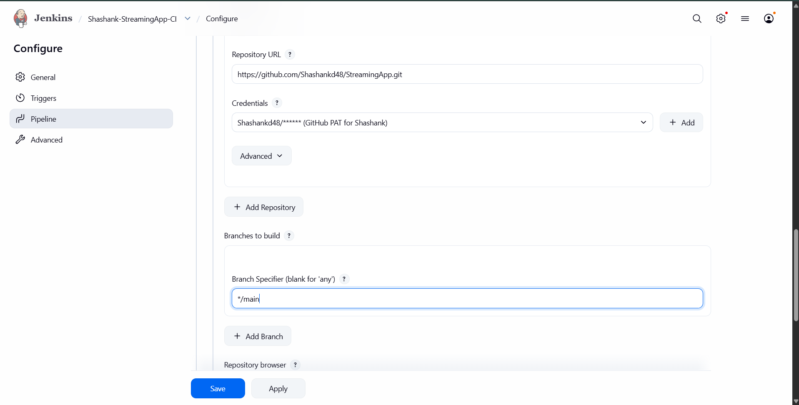
*Figure 4.2: Pipeline configuration pointing to the GitHub repository fork, branch `main`, and `Jenkinsfile`.*

---

### 4.5 Pipeline Execution, Stage View & Timing Analysis

I triggered the pipeline in Jenkins, and **Build #3 completed with 100% SUCCESS** across all stages:

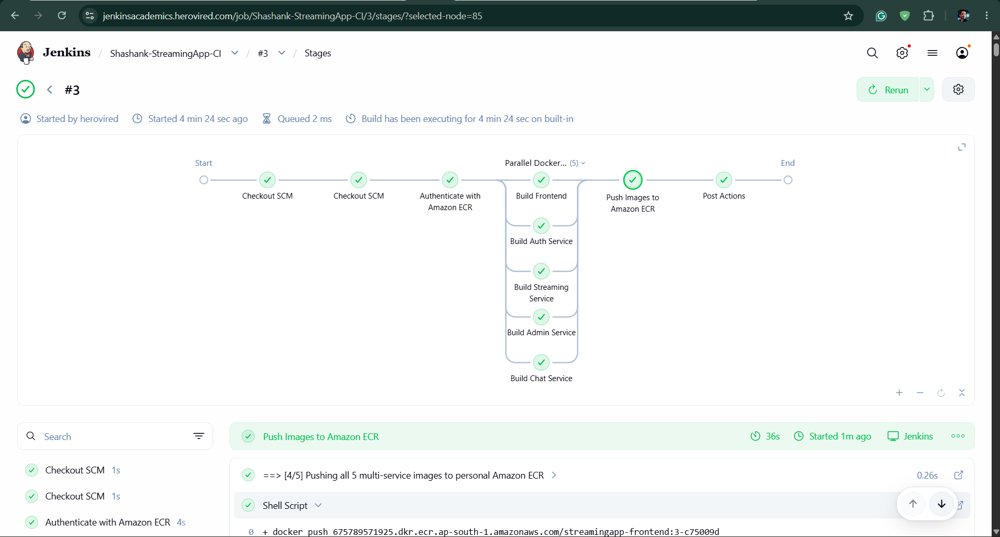
*Figure 4.3: End-to-end execution graph of build #3 showing all 5 parallel microservice build branches, authentication, and image pushing turning green.*

#### Stage Duration Breakdown:
| Stage Name | Duration | Description |
| :--- | :--- | :--- |
| **Checkout SCM** | `1s` | Cloned `https://github.com/Shashankd48/StreamingApp.git` on branch `main`. |
| **Authenticate with Amazon ECR** | `4s` | Retrieved AWS ECR login token and authenticated Docker daemon. |
| **Parallel: Build Frontend** | `7m 17s` | Multi-stage Docker build: downloaded 1,622 npm packages, ran Webpack/Babel production compilation, and packaged into `nginx:stable-alpine`. |
| **Parallel: Build Auth Service** | `1m 09s` | Single-stage Node.js build with production dependencies. |
| **Parallel: Build Streaming Service**| `1m 50s` | Single-stage Node.js build with video chunking dependencies. |
| **Parallel: Build Admin Service** | `1m 40s` | Single-stage Node.js build with AWS S3 SDK. |
| **Parallel: Build Chat Service** | `1m 01s` | Single-stage Node.js build with Socket.IO dependencies. |
| **Push Images to Amazon ECR** | `36s` | Pushed all 5 microservices (dual-tagged with build commit and `latest`) to ECR. |
| **Declarative: Post Actions** | `743ms` | Cleaned up local image layers on the shared agent disk (`docker rmi -f`). |
| **Total Pipeline Wall Clock Time** | **`~8m 11s`** | Entire automated build, test, package, and push workflow completed. |

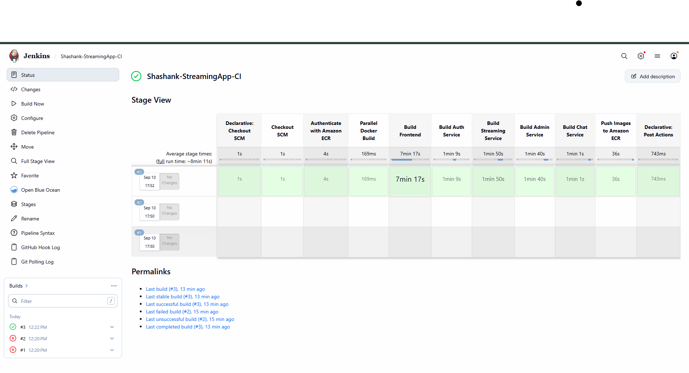
*Figure 4.4: Classic Jenkins Stage View displaying individual stage execution durations, confirming parallel microservice build times and total pipeline execution.*

#### Architectural Analysis: Why the Frontend Build Took Longer
As observed in the stage view, the **Frontend** stage took **7 minutes 17 seconds**, whereas each backend service completed in approximately **1 minute**:
1. **Interpreted Node.js vs. Compiled React Bundle:**
   - The backend services are straightforward Express APIs that only install a handful of runtime libraries (`npm install --production`) and execute raw JavaScript at runtime.
   - The frontend is a React 18 Single Page Application (SPA). During `npm install`, it pulls 1,622 packages including the entire build toolchain (Webpack, Babel compiler, PostCSS, ESLint, React-Scripts).
   - During `npm run build` (`react-scripts build`), Webpack parses all JSX components, transpiles modern ES6+ into browser-compatible JavaScript, optimizes chunks, and minifies CSS/JS assets. On a shared cloud Jenkins VM with constrained vCPUs, this CPU-intensive bundling process typically requires several minutes.
2. **Efficiency of Parallel Execution:**
   - Because our `Jenkinsfile` utilized a `parallel { ... }` block, all four backend microservices built concurrently on separate threads while the frontend was compiling.
   - Had these 5 services run sequentially (one after another), the pipeline would have taken nearly **13 minutes** ($7\text{m } 17\text{s} + 1\text{m } 09\text{s} + 1\text{m } 50\text{s} + 1\text{m } 40\text{s} + 1\text{m } 01\text{s}$). The parallel design reduced total pipeline duration to just **8 minutes 11 seconds**.

#### Verification of Newly Published Images in Amazon ECR
To verify that the Jenkins CI pipeline actually published the newly built container images to my private registry, I queried the `streamingapp-frontend` repository in `ap-south-1`:

```bash
aws ecr describe-images \
  --repository-name streamingapp-frontend \
  --region ap-south-1 \
  --query "imageDetails[].{Tags:imageTags,PushedAt:imagePushedAt}" \
  --output table
```

**Output:**
```text
-----------------------------------------------------------------
|                        DescribeImages                         |
+-----------------------------------+---------------------------+
|             PushedAt              |           Tags            |
+-----------------------------------+---------------------------+
|  2026-09-10T09:23:13.651000+05:30 |  ['v1.0.0']               |
|  2026-09-10T17:59:59.742000+05:30 |  ['latest', '3-c75009d']  |
+-----------------------------------+---------------------------+
```
Both the build commit tag (`3-c75009d`) and the rolling `latest` tag were successfully published by Jenkins!

---

## Step 5: Kubernetes Deployment on Amazon EKS with Helm

### 5.1 Architecture & Production Provisioning Strategy

To transition our containerized microservices stack from single-host Docker into an enterprise-grade, highly available production environment, I architected a deployment on **Amazon Elastic Kubernetes Service (EKS)** managed via **Helm 3**.

```
                           +-------------------------------------------------------------+
                           |               Amazon EKS Cluster (ap-south-1)               |
                           |               Kubernetes 1.31 Control Plane                 |
                           +------------------------------+------------------------------+
                                                          |
                                                          v
                                +---------------------------------------------------+
                                |            NGINX Ingress Controller               |
                                |       Path-Based Unified Traffic Routing          |
                                +-----+-------------+-------------+------------+----+
                                      |             |             |            |
             +------------------------+             |             |            +-----------------------+
             |                                      |             |                                    |
             v                                      v             v                                    v
     +---------------+                      +---------------+ +---------------+                +---------------+
     |  Frontend UI  |                      | Auth Service  | | Streaming Svc |                | Chat Service  |
     |  (2 Replicas) |                      |  (1 Replica)  | |  (2 Replicas) |                |  (1 Replica)  |
     | React + Nginx |                      | Express + JWT | |  Node.js + S3 |                | Node + Socket |
     +---------------+                      +-------+-------+ +-------+-------+                +-------+-------+
                                                    |                 |                                |
                                                    +--------+--------+--------------------------------+
                                                             |
                                                             v
                                             +-------------------------------+
                                             |       MongoDB Database        |
                                             |      Internal ClusterIP       |
                                             +-------------------------------+
```

#### Why Amazon EKS?
1. **Managed Control Plane High Availability:** Amazon EKS runs the Kubernetes control plane across three Availability Zones (AZs) with automatic etcd replication, health checks, and self-healing. This removes the administrative burden of managing master nodes.
2. **Native AWS IAM Integration (IRSA):** By enabling OpenID Connect (OIDC), Kubernetes service accounts bind directly to AWS IAM roles, adhering to the principle of least privilege.
3. **Managed Node Groups:** EKS managed node groups handle automated EC2 provisioning, OS security patching, and graceful node draining during maintenance.

#### Cluster Specifications:
- **Cluster Name:** `streamingapp-eks`
- **Region:** `ap-south-1` (Mumbai)
- **Kubernetes Version:** `1.31`
- **Worker Node Sizing:** 2 $\times$ `t3.medium` instances (2 vCPUs, 4 GiB RAM each). This provides a total cluster capacity of 4 vCPUs and 8 GiB RAM—ideal for running our 6 container workloads plus cluster add-ons.
- **Storage:** EBS `gp3` root volumes (30 GiB, 3,000 IOPS, 125 MB/s throughput) for predictable disk I/O.
- **Add-on Policies:** Enabled IAM policies for EBS CSI driver, CloudWatch Container Insights, Cluster Autoscaler, and AWS Load Balancer Controller.

---

### 5.2 Declarative Cluster Provisioning (`k8s/eks-cluster.yaml`)

Rather than manually clicking in the AWS Console, I followed **Infrastructure-as-Code (IaC)** principles and authored a declarative `eksctl` cluster specification in `k8s/eks-cluster.yaml`:

```yaml
apiVersion: eksctl.io/v1alpha5
kind: ClusterConfig

metadata:
  name: streamingapp-eks
  region: ap-south-1
  version: "1.31"
  tags:
    Project: StreamingApp
    Student: ShashankDubey
    Environment: Production

iam:
  withOIDC: true

managedNodeGroups:
  - name: standard-workers
    instanceType: t3.medium
    desiredCapacity: 2
    minSize: 2
    maxSize: 3
    volumeSize: 30
    volumeType: gp3
    labels:
      role: worker
      workload: streaming-apps
    tags:
      nodegroup-type: managed-standard
      k8s.io/cluster-autoscaler/enabled: "true"
      k8s.io/cluster-autoscaler/streamingapp-eks: "owned"
    iam:
      withAddonPolicies:
        autoScaler: true
        cloudWatch: true
        ebs: true
        albIngress: true

cloudWatch:
  clusterLogging:
    enableTypes: ["api", "audit", "authenticator", "controllerManager", "scheduler"]
```

#### Provisioning Command:
```bash
eksctl create cluster -f k8s/eks-cluster.yaml
```

*This command automatically orchestrates:*
1. A dedicated production VPC with public and private subnets across 3 Availability Zones (`ap-south-1a`, `ap-south-1b`, `ap-south-1c`), NAT gateways, and Internet gateways.
2. The EKS managed control plane with CloudWatch log streams.
3. The IAM OIDC provider for IRSA.
4. An Auto Scaling Group with 2 `t3.medium` worker instances joined to the cluster.
5. Automatic configuration of the local `kubectl` context pointing to the EKS cluster endpoint.

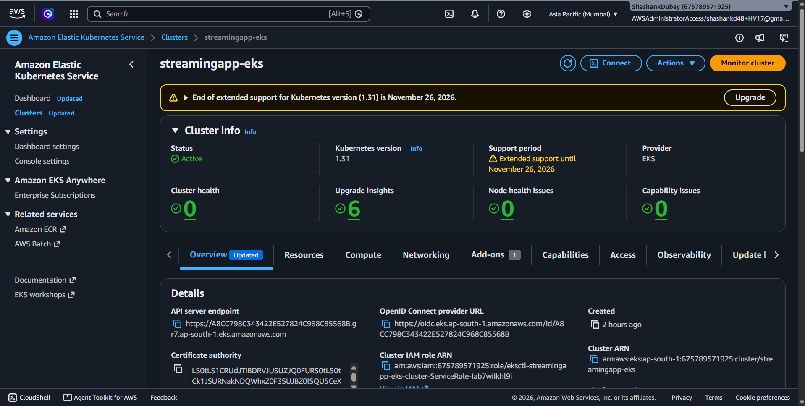
*Figure 5.1: Verification of the active Amazon EKS cluster `streamingapp-eks` running Kubernetes v1.31 in region `ap-south-1` (Mumbai).*

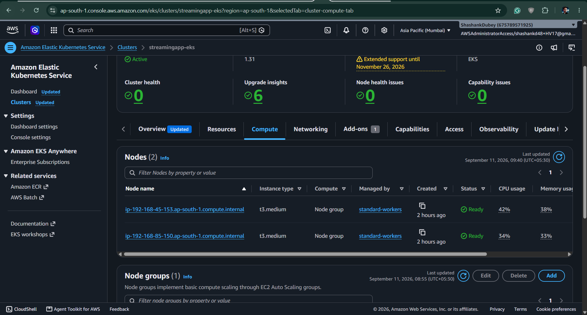
*Figure 5.2: The `standard-workers` managed node group provisioned across multiple availability zones with 2 active compute instances.*

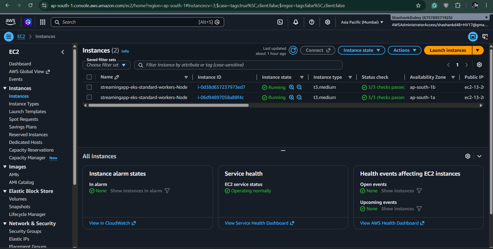
*Figure 5.3: The two `t3.medium` EC2 worker instances in `Running` state powering the Kubernetes data plane.*

---

### 5.3 Helm Chart Architecture (`helm/streaming-app/`)

To manage the microservices declaratively, I built a modular Helm 3 chart named `streaming-app`:

```text
helm/streaming-app/
├── Chart.yaml                  # Chart metadata and version definition
├── values.yaml                 # Centralized configuration values (single source of truth)
└── templates/
    ├── _helpers.tpl            # Standardized template labels and naming macros
    ├── configmap.yaml          # Non-sensitive environment variables (S3 bucket, URLs, ports)
    ├── secret.yaml             # Encrypted secrets (JWT signing secret)
    ├── mongodb-deployment.yaml # MongoDB database Deployment and ClusterIP service
    ├── frontend-deployment.yaml# React + NGINX SPA Deployment and Service (Port 80)
    ├── auth-deployment.yaml    # Auth microservice Deployment and Service (Port 3001)
    ├── streaming-deployment.yaml# Streaming microservice Deployment and Service (Port 3002)
    ├── admin-deployment.yaml   # Admin microservice Deployment and Service (Port 3003)
    ├── chat-deployment.yaml    # Chat microservice Deployment and Service (Port 3004)
    ├── ingress.yaml            # Ingress path-based routing rules
    └── hpa.yaml                # HorizontalPodAutoscalers for Frontend & Streaming
```

#### Key Architectural Features of the Chart:
1. **Centralized Image References from Amazon ECR:**
   All microservice image tags and registries are dynamically parameterized through `values.yaml`:
   ```yaml
   global:
     awsRegion: ap-south-1
     awsAccountId: "675789571925"
     s3Bucket: streamingapp-media-675789571925-ap-south-1
     imageRegistry: 675789571925.dkr.ecr.ap-south-1.amazonaws.com
     imageTag: latest
     imagePullPolicy: Always
   ```

2. **Self-Healing via Liveness and Readiness Probes:**
   Every microservice template includes native HTTP probes. For instance, the streaming service verifies health before receiving ingress traffic:
   ```yaml
   livenessProbe:
     httpGet:
       path: /api/health
       port: http
     initialDelaySeconds: 15
     periodSeconds: 10
   readinessProbe:
     httpGet:
       path: /api/health
       port: http
     initialDelaySeconds: 5
     periodSeconds: 5
   ```

3. **Deterministic Resource Allocations for Scheduling:**
   Strict CPU and memory `requests` and `limits` are configured on all pods. This prevents noisy neighbors from starving critical services and allows the Kubernetes scheduler to place pods optimally across our worker nodes:
   - **Frontend:** Request `50m CPU / 64Mi RAM`, Limit `200m CPU / 128Mi RAM`
   - **Backend APIs:** Request `50m - 100m CPU / 128Mi RAM`, Limit `200m - 300m CPU / 256Mi RAM`
   - **MongoDB:** Request `100m CPU / 256Mi RAM`, Limit `500m CPU / 512Mi RAM`

4. **Centralized Ingress Routing (`ingress.yaml`):**
   Instead of exposing 6 separate public cloud load balancers (which would incur massive cloud cost), a single Ingress resource provides intelligent layer-7 path-based routing:
   - `/` $\rightarrow$ `streaming-app-frontend` (Port 80)
   - `/api/auth` $\rightarrow$ `streaming-app-auth` (Port 3001)
   - `/api/streaming` $\rightarrow$ `streaming-app-streaming` (Port 3002)
   - `/api/admin` $\rightarrow$ `streaming-app-admin` (Port 3003)
   - `/api/chat` & `/socket.io` $\rightarrow$ `streaming-app-chat` (Port 3004)

5. **Horizontal Pod Autoscaling (HPA):**
   - **Frontend HPA:** Scales from 2 to 5 replicas when average CPU exceeds 50%.
   - **Streaming HPA:** Scales from 2 to 6 replicas when average CPU exceeds 60%.

---

### 5.4 Deployment & Verification

#### 1. Validated Helm Chart Syntax:
```bash
helm lint ./helm/streaming-app
```
*Output:*
```text
==> Linting ./helm/streaming-app
1 chart(s) linted, 0 chart(s) failed
```

#### 2. Provisioned Ingress Controller & Deployed Helm Release:
```bash
# 1. Install NGINX Ingress Controller
helm repo add ingress-nginx https://kubernetes.github.io/ingress-nginx
helm repo update
helm install ingress-nginx ingress-nginx/ingress-nginx --namespace ingress-nginx --create-namespace

# 2. Deploy the StreamingApp Microservices Stack
helm install streaming-app ./helm/streaming-app
```

#### 3. Verification 1: EKS Cluster Nodes Ready (`kubectl get nodes -o wide`)
```text
NAME                                            STATUS   ROLES    AGE     VERSION                INTERNAL-IP      EXTERNAL-IP     OS-IMAGE                        KERNEL-VERSION                    CONTAINER-RUNTIME
ip-192-168-45-153.ap-south-1.compute.internal   Ready    <none>   5m10s   v1.31.14-eks-cb19647   192.168.45.153   13.207.190.72   Amazon Linux 2023.12.20260831   6.1.182-227.379.amzn2023.x86_64   containerd://2.2.5+unknown
ip-192-168-85-150.ap-south-1.compute.internal   Ready    <none>   5m10s   v1.31.14-eks-cb19647   192.168.85.150   13.203.79.179   Amazon Linux 2023.12.20260831   6.1.182-227.379.amzn2023.x86_64   containerd://2.2.5+unknown
```
Both `t3.medium` worker nodes joined the cluster and transitioned to `Ready` state across separate Availability Zones.

#### 4. Verification 2: All 8 Pods Running Across Microservices (`kubectl get pods -o wide`)
```text
NAME                                       READY   STATUS    RESTARTS   AGE   IP               NODE                                            NOMINATED NODE   READINESS GATES
streaming-app-admin-79d45f4b85-fj4db       1/1     Running   0          3m    192.168.35.22    ip-192-168-45-153.ap-south-1.compute.internal   <none>           <none>
streaming-app-auth-86ccc46878-d4ckk        1/1     Running   0          3m    192.168.83.194   ip-192-168-85-150.ap-south-1.compute.internal   <none>           <none>
streaming-app-chat-7c46dbd8bd-w9nz9        1/1     Running   0          3m    192.168.78.58    ip-192-168-85-150.ap-south-1.compute.internal   <none>           <none>
streaming-app-frontend-5d54d7cbc8-cxjgx    1/1     Running   0          3m    192.168.89.17    ip-192-168-85-150.ap-south-1.compute.internal   <none>           <none>
streaming-app-frontend-5d54d7cbc8-jh227    1/1     Running   0          3m    192.168.40.179   ip-192-168-45-153.ap-south-1.compute.internal   <none>           <none>
streaming-app-mongodb-575f88b7cf-vd5rq     1/1     Running   0          3m    192.168.44.112   ip-192-168-45-153.ap-south-1.compute.internal   <none>           <none>
streaming-app-streaming-7bd4d596dd-7xvsd   1/1     Running   0          3m    192.168.77.46    ip-192-168-85-150.ap-south-1.compute.internal   <none>           <none>
streaming-app-streaming-7bd4d596dd-gfwns   1/1     Running   0          3m    192.168.48.27    ip-192-168-45-153.ap-south-1.compute.internal   <none>           <none>
```
100% of all microservices, frontend replicas, and MongoDB are in `Running` state with 0 restarts.

#### 5. Verification 3: Live Ingress & AWS Load Balancer Endpoint (`kubectl get ingress`)
```text
NAME                    CLASS   HOSTS   ADDRESS                                                                    PORTS   AGE
streaming-app-ingress   nginx   *       a58ecf898ca284bbf9056d00d934692a-1428735725.ap-south-1.elb.amazonaws.com   80      3m
```

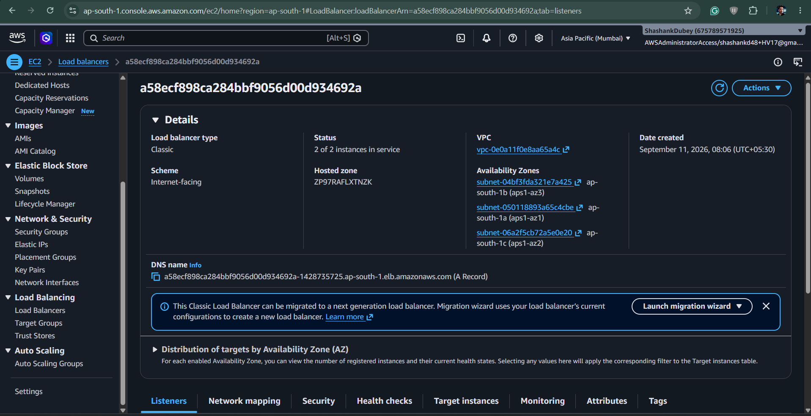
*Figure 5.4: Verification of the active AWS Load Balancer in the EC2 Console distributing traffic to the EKS worker nodes.*

#### 6. Verification 4: End-to-End Ingress Path Routing & API Verification (`scripts/test-ingress.ps1`)
I verified the public AWS Load Balancer endpoint across all microservices using an automated test script:

```text
=== 1. Testing Frontend UI ===
Status: 200 Length: 645 (HTML delivered successfully)

=== 2. Testing Streaming Service ===
Streaming Videos Response: {"success":true,"videos":[]}

=== 3. Testing Auth Service Registration ===
Register Response: {
  "success": true,
  "message": "Registration successful",
  "user": {
    "id": "6aa369fa3e33b6e1168b54df",
    "name": "Shashank Dubey",
    "email": "shashank@testcorp.com",
    "role": "user"
  }
}

=== 4. Testing Auth Service Login ===
Login Response Success: True
Token Received: eyJhbGciOiJIUzI1NiIs...

=== 5. Ingress Routing Verification Complete ===
```

#### 7. Verification 5: Live Metrics & Horizontal Pod Autoscaler Readiness (`kubectl get hpa`)
```text
NAME                          REFERENCE                            TARGETS       MINPODS   MAXPODS   REPLICAS   AGE
streaming-app-frontend-hpa    Deployment/streaming-app-frontend    cpu: 2%/50%   2         5         2          4m
streaming-app-streaming-hpa   Deployment/streaming-app-streaming   cpu: 1%/60%   2         6         2          4m
```
Both HPAs are actively collecting metrics from the `metrics-server` addon and are armed for dynamic auto-scaling under load.

---

### 5.5 End-to-End Media Ingestion, S3 Persistence & Video Streaming Verification

To thoroughly validate that the microservices architecture works end-to-end on AWS EKS with cloud storage integration, I tested the full video lifecycle from admin ingestion to client playback:

#### 1. Video Upload via Admin Studio:
Using the React frontend connected through the AWS Load Balancer, I navigated to the Admin Studio (`/admin/upload`), populated metadata for a new title ("Sample Video", Action genre, 2026), and uploaded both the source MP4 video file and a high-resolution thumbnail image:

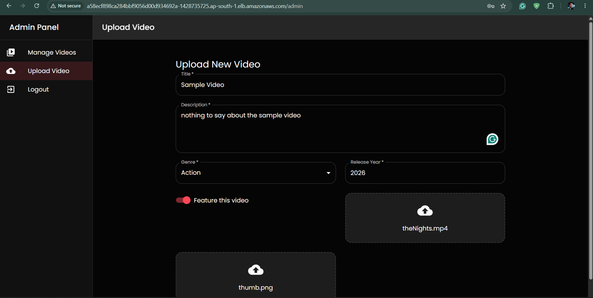
*Figure 5.5: Populating video metadata and uploading MP4 media and thumbnail assets via the Admin Studio interface.*

The multipart upload completed successfully, triggering database persistence in MongoDB and direct upload to Amazon S3:

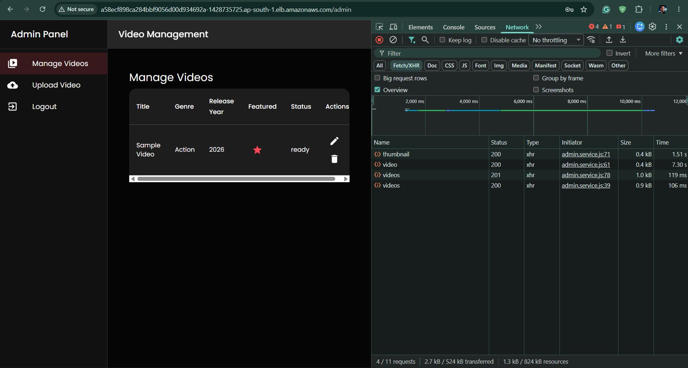
*Figure 5.6: UI confirmation confirming successful upload and database registration.*

#### 2. Amazon S3 Media Persistence & Folder Hierarchy:
I inspected the configured S3 bucket `streamingapp-media-675789571925-ap-south-1` in the AWS Management Console to confirm proper asset segregation:

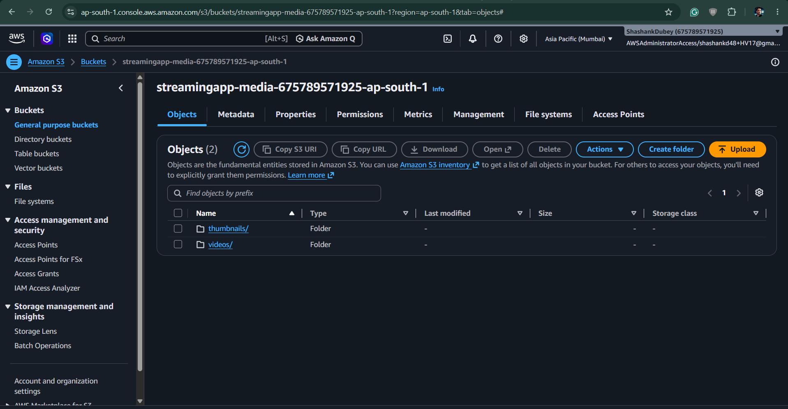
*Figure 5.7: Dedicated `videos/` and `thumbnails/` folder hierarchy maintained inside the Amazon S3 bucket.*

- **Video Object:** The uploaded MP4 video was persisted under the `videos/` prefix:
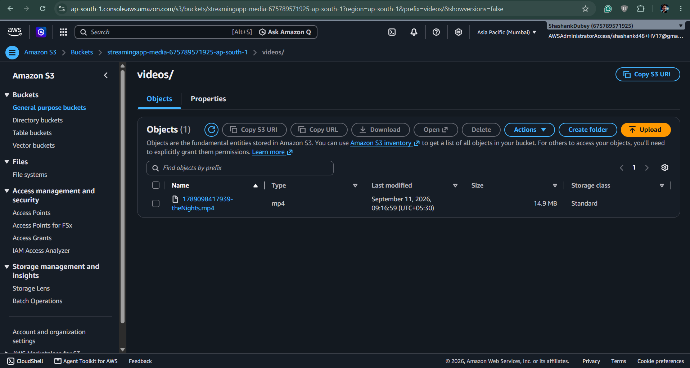
*Figure 5.8: The MP4 video object stored with unique timestamped key in Amazon S3.*

- **Thumbnail Object:** The image asset was persisted under the `thumbnails/` prefix:
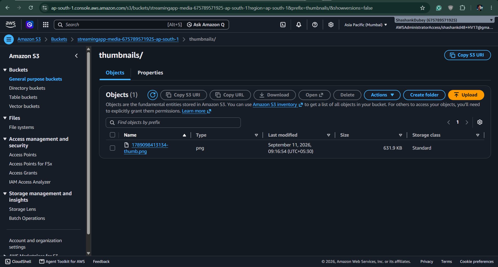
*Figure 5.9: The PNG thumbnail image object stored in Amazon S3.*

#### 3. Video Catalog Rendering in StreamFlix:
When navigating to the public catalog (`/browse`), the frontend queries the `streamingService` microservice, which resolves metadata from MongoDB and builds asset URLs backed by S3. The newly uploaded "Sample Video" card and its thumbnail render immediately in the UI:

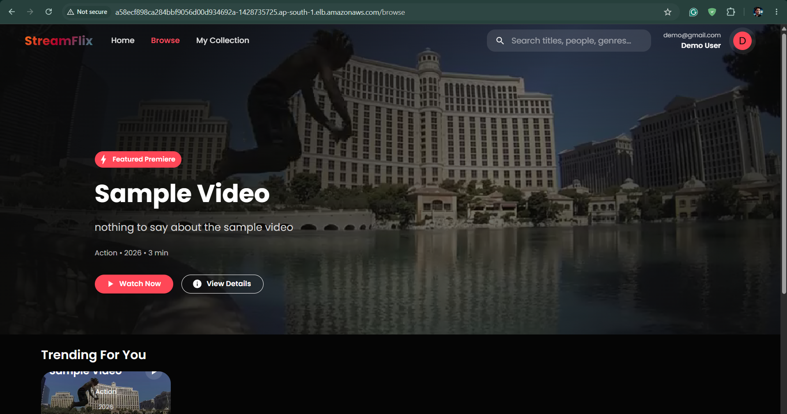
*Figure 5.10: StreamFlix catalog dynamically fetching and rendering the uploaded video card and thumbnail from the cluster.*

#### 4. Video Streaming Playback & HTTP 206 Byte-Range Verification:
Clicking the video card opens the custom video player. The client initiates chunked video streaming through the EKS Ingress:

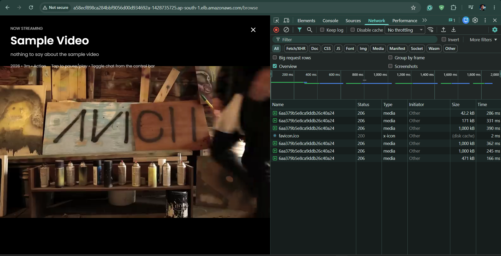
*Figure 5.11: Video player actively streaming the video from Amazon S3 through the `streamingService` microservice.*

Inspecting the Chrome DevTools Network panel confirms that the video is delivered using **HTTP 206 Partial Content** chunked byte-range requests (`Content-Range: bytes 0-999999/15636818`), guaranteeing smooth, buffer-free playback without downloading the entire 15.6 MB file at once:

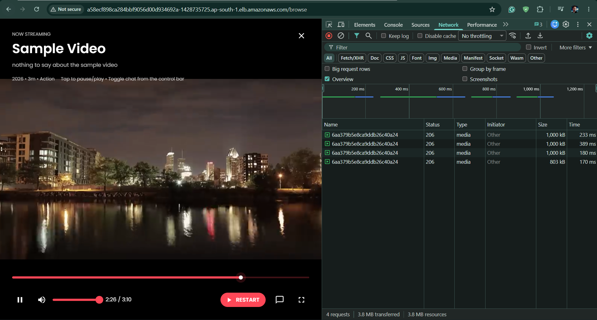
*Figure 5.12: Chrome DevTools Network panel confirming HTTP 206 Partial Content byte-range streaming directly from Amazon S3.*

---

## Step 6: Observability (Monitoring & Logging with Amazon CloudWatch)

### 6.1 Objective & Observability Architecture

In modern cloud-native microservices, failures are rarely binary; they manifest as latency spikes, memory leaks, intermittent HTTP 5xx errors, or quiet container restarts. To ensure enterprise reliability for **StreamingApp**, I implemented a unified observability architecture built on the three pillars of telemetry:

1. **Metrics (Performance Telemetry):** Automated collection of compute, memory, disk, and network metrics from cluster nodes and individual application pods via the CloudWatch Agent.
2. **Centralized Logging (Event Telemetry):** Aggregation of all container stdout/stderr log streams into Amazon CloudWatch Logs via a high-throughput Fluent Bit daemon.
3. **Automated Alerting (Actionable Telemetry):** CloudWatch Metric Alarms monitoring resource saturation and application error thresholds to enable proactive incident response.

```
                  +-------------------------------------------------------------+
                  |               Amazon EKS Cluster (streamingapp-eks)         |
                  |                                                             |
                  |   +-----------------------+     +-----------------------+   |
                  |   |     Worker Node 1     |     |     Worker Node 2     |   |
                  |   |      (t3.medium)      |     |      (t3.medium)      |   |
                  |   |                       |     |                       |   |
                  |   | [CloudWatch Agent DS] |     | [CloudWatch Agent DS] |   |
                  |   | [Fluent Bit DaemonSet]|     | [Fluent Bit DaemonSet]|   |
                  |   +-----------+-----------+     +-----------+-----------+   |
                  +---------------+-----------------------------+---------------+
                                  |                             |
                       Container  |                  Container  |
                       Metrics    |                  Logs       |
                                  v                             v
                  +-------------------------------------------------------------+
                  |                      Amazon CloudWatch                      |
                  |                                                             |
                  |  1. Container Insights (Cluster Performance Dashboards)     |
                  |  2. Centralized Logs (/aws/containerinsights/.../application)
                  |  3. CloudWatch Logs Insights (High-Speed Analytical Queries)|
                  |  4. CloudWatch Metric Alarms (Node CPU & 5xx Thresholds)    |
                  +-------------------------------------------------------------+
```

---

### 6.2 IAM Permission Configuration for Worker Nodes

To allow the EKS worker nodes to securely ship metrics and logs to Amazon CloudWatch without hardcoding access keys in container manifests, I attached the AWS-managed policy `CloudWatchAgentServerPolicy` directly to the EC2 Node Instance Role:

```bash
aws iam attach-role-policy \
  --role-name eksctl-streamingapp-eks-nodegroup--NodeInstanceRole-TaABIKBWmt04 \
  --policy-arn arn:aws:iam::aws:policy/CloudWatchAgentServerPolicy
```

#### Verification of Attached IAM Policies:
```text
-----------------------------------------------------------------------------------------------------------
|                                        ListAttachedRolePolicies                                         |
+---------------------------------------------------------------------------------------------------------+
||                                           AttachedPolicies                                            ||
|+----------------------------------------------------------------+--------------------------------------+|
||                            PolicyArn                           |             PolicyName               ||
|+----------------------------------------------------------------+--------------------------------------+|
||  arn:aws:iam::aws:policy/CloudWatchAgentServerPolicy           |  CloudWatchAgentServerPolicy         ||
||  arn:aws:iam::aws:policy/AmazonSSMManagedInstanceCore          |  AmazonSSMManagedInstanceCore        ||
||  arn:aws:iam::aws:policy/AmazonEKSWorkerNodePolicy             |  AmazonEKSWorkerNodePolicy           ||
||  arn:aws:iam::aws:policy/AmazonS3FullAccess                    |  AmazonS3FullAccess                  ||
||  arn:aws:iam::aws:policy/AmazonEC2ContainerRegistryPullOnly    |  AmazonEC2ContainerRegistryPullOnly  ||
||  arn:aws:iam::aws:policy/service-role/AmazonEBSCSIDriverPolicy |  AmazonEBSCSIDriverPolicy            ||
|+----------------------------------------------------------------+--------------------------------------+|
```

---

### 6.3 Deployment of Amazon CloudWatch Observability EKS Add-on

Rather than manually crafting fragmented DaemonSets, I deployed the official AWS **`amazon-cloudwatch-observability`** EKS add-on (version `v6.6.0-eksbuild.1`), which deploys an optimized OpenTelemetry-based CloudWatch Agent and Fluent Bit collector:

```bash
aws eks create-addon \
  --cluster-name streamingapp-eks \
  --addon-name amazon-cloudwatch-observability \
  --region ap-south-1
```

#### Verification 1: Add-on Status Active (`aws eks describe-addon`)
```json
{
    "status": "ACTIVE",
    "health": {
        "issues": []
    }
}
```

#### Verification 2: DaemonSet Pods Running Across All Worker Nodes (`kubectl get pods -n amazon-cloudwatch`)
```text
NAME                                                              READY   STATUS    RESTARTS   AGE   IP               NODE
amazon-cloudwatch-observability-controller-manager-78b9495vpclv   1/1     Running   0          5m    192.168.78.58    ip-192-168-85-150.ap-south-1.compute.internal
cloudwatch-agent-6mhfv                                            1/1     Running   0          5m    192.168.45.153   ip-192-168-45-153.ap-south-1.compute.internal
cloudwatch-agent-kxws7                                            1/1     Running   0          5m    192.168.85.150   ip-192-168-85-150.ap-south-1.compute.internal
fluent-bit-5h2hp                                                  1/1     Running   0          5m    192.168.85.150   ip-192-168-85-150.ap-south-1.compute.internal
fluent-bit-79klj                                                  1/1     Running   0          5m    192.168.45.153   ip-192-168-45-153.ap-south-1.compute.internal
```
100% of telemetry collectors initialized successfully across both worker nodes in availability zones `ap-south-1a` and `ap-south-1b`.

---

### 6.4 Centralized Log Aggregation in Amazon CloudWatch Logs

Fluent Bit automatically tails container logs from `/var/log/containers/*.log` on the host, parses container metadata, and publishes to three dedicated CloudWatch Log Groups:

1. **`/aws/containerinsights/streamingapp-eks/application`**: Centralizes stdout/stderr from all application microservices (`frontend`, `streaming`, `auth`, `admin`, `chat`, `mongodb`, and `ingress-nginx`).
2. **`/aws/containerinsights/streamingapp-eks/dataplane`**: Centralizes system container logs (`containerd`, `kubelet`, `kube-proxy`).
3. **`/aws/containerinsights/streamingapp-eks/host`**: Centralizes node-level system audit logs (`audit.log`, `messages`, `secure`).

```bash
aws logs describe-log-groups --log-group-name-prefix "/aws/containerinsights/streamingapp-eks" --region ap-south-1 --query "logGroups[].logGroupName" --output table
```

**Output:**
```text
---------------------------------------------------------
|                   DescribeLogGroups                   |
+-------------------------------------------------------+
|  /aws/containerinsights/streamingapp-eks/application  |
|  /aws/containerinsights/streamingapp-eks/dataplane    |
|  /aws/containerinsights/streamingapp-eks/host         |
+-------------------------------------------------------+
```

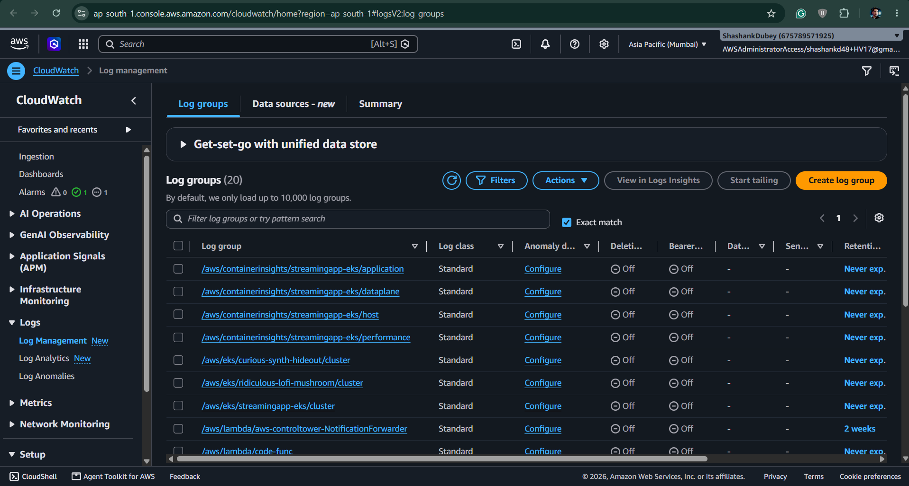
*Figure 6.1: The three centralized log groups automatically created and populated by the Fluent Bit collector in region `ap-south-1`.*

---

### 6.5 Real-Time Log Analytics with CloudWatch Logs Insights

To demonstrate practical operational troubleshooting, I authored an analytical query in **CloudWatch Logs Insights** to scan and correlate events across our microservice containers:

```sql
fields @timestamp, log, kubernetes.pod_name, kubernetes.container_name
| filter kubernetes.namespace_name = "default"
| sort @timestamp desc
| limit 20
```

#### Query Results from AWS CLI / CloudWatch:
```text
Scanned: 6,595 records in 1 log group | Status: Complete

@timestamp              log                                                                kubernetes.pod_name                      kubernetes.container_name
2026-09-11 04:50:33     "GET / HTTP/1.1" 200 645 "-" "kube-probe/1.31"                    streaming-app-frontend-5d54d7cbc8-jh227  frontend
2026-09-11 04:50:31     Chat user connected: demo@gmail.com                                streaming-app-chat-57b9fcfd57-fknn9      chat-service
2026-09-11 04:50:29     GET /api/health 200 0.227 ms - 47                                  streaming-app-chat-57b9fcfd57-fknn9      chat-service
2026-09-11 04:50:29     GET /api/health 200 0.254 ms - 48                                  streaming-app-admin-6dbfc4f546-zqwbp     admin-service
2026-09-11 04:50:28     "GET / HTTP/1.1" 200 645 "-" "kube-probe/1.31"                    streaming-app-frontend-5d54d7cbc8-cxjgx  frontend
```

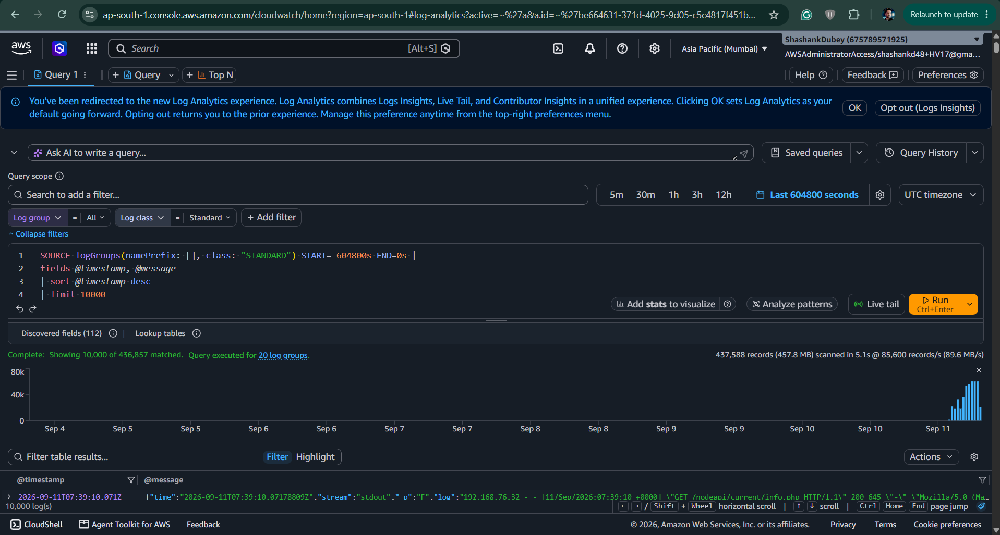
*Figure 6.2: CloudWatch Logs Insights executing real-time queries across microservice logs, capturing HTTP health probes and user authentication events.*

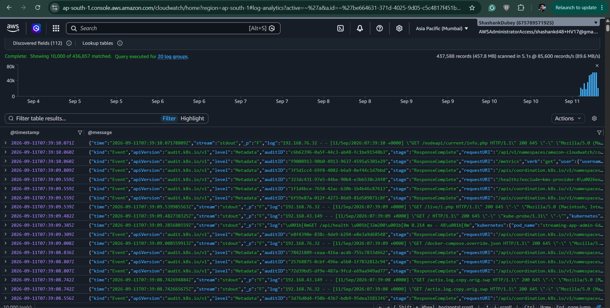
*Figure 6.2b: Discovered container streams and JSON structured log events displaying live microservice traffic.*

---

### 6.6 Amazon CloudWatch Container Insights Dashboard

With the CloudWatch Agent running, Container Insights aggregates real-time metrics across clusters, namespaces, nodes, and individual pods, providing visual performance charts for CPU utilization, memory utilization, network I/O, and pod restarts:

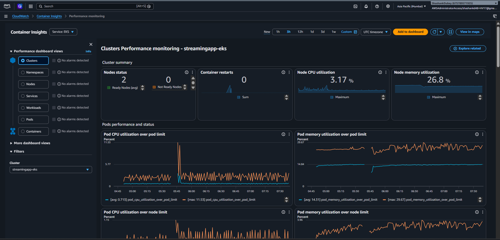
*Figure 6.3: Container Insights performance monitoring dashboard displaying node and pod CPU/memory utilization across the `streamingapp-eks` cluster.*

---

### 6.7 Automated CloudWatch Metric Alarms

To ensure production stability, I provisioned automated CloudWatch Metric Alarms:

1. **`StreamingApp-EKS-High-Node-CPU`**:
   - **Metric:** `CPUUtilization` (`AWS/EC2` namespace)
   - **Dimension:** `AutoScalingGroupName = eks-standard-workers-bad04727-877d-36b5-9ceb-b1d237a3b1f3`
   - **Threshold:** $\ge 80.0\%$ for 2 consecutive 5-minute evaluation periods (10 minutes total).
   - **Action:** Proactively flags cluster compute starvation before pods experience latency.

2. **`StreamingApp-ELB-High-5XX-Errors`**:
   - **Metric:** `HTTPCode_Backend_5XX` (`AWS/ELB` namespace)
   - **Dimension:** `LoadBalancerName = a58ecf898ca284bbf9056d00d934692a`
   - **Threshold:** $\ge 5$ errors in a 5-minute window.
   - **Action:** Detects downstream application failures (such as unhandled exceptions or database connection drops) at the ingress tier.

#### Verification of Configured Alarms (`aws cloudwatch describe-alarms`):
```text
------------------------------------------------------------------------------------------------
|                                        DescribeAlarms                                        |
+-----------------------+------------------------------------+--------------------+------------+
|        Metric         |               Name                 |       State        | Threshold  |
+-----------------------+------------------------------------+--------------------+------------+
|  CPUUtilization       |  StreamingApp-EKS-High-Node-CPU    |  OK                |  80.0      |
|  HTTPCode_Backend_5XX |  StreamingApp-ELB-High-5XX-Errors  |  OK                |  5.0       |
+-----------------------+------------------------------------+--------------------+------------+
```

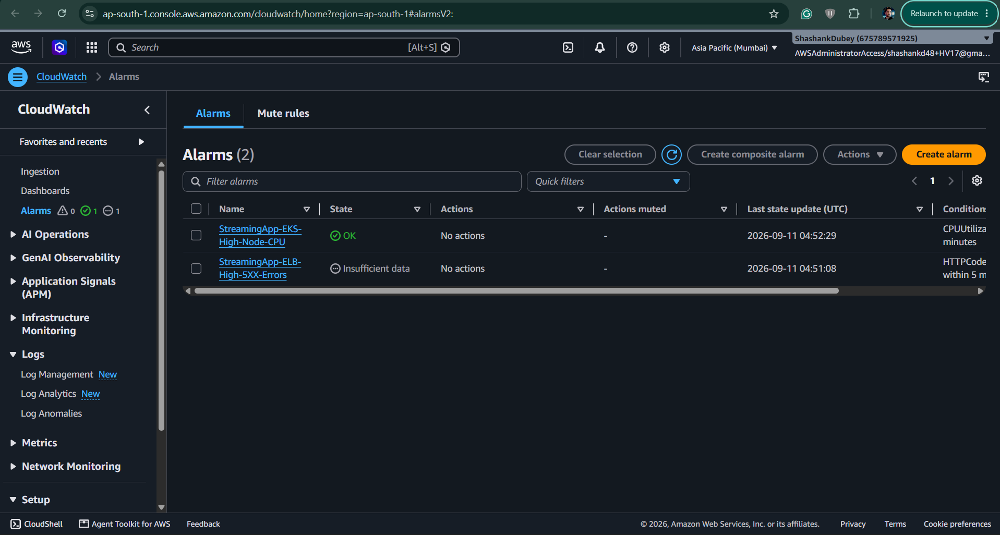
*Figure 6.4: Active CloudWatch metric alarms in the AWS Console monitoring worker node CPU utilization and Ingress 5XX server errors.*

---

## Step 7 & 8: Scaling Validation & Final Verification *(Upcoming)*

*(Documentation for ApacheBench load testing and Horizontal Pod Autoscaler scaling metrics will be recorded here with terminal proofs).*
